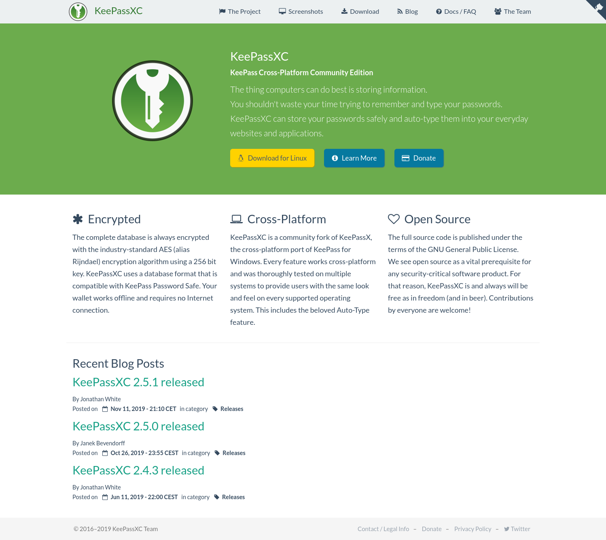

# keepassxc_site

[](https://github.com/keepassxreboot/keepassxreboot.github.io/issues) [] [](https://liberapay.com/keepassxc)

> Website files for **[KeePassXC](https://keepassxc.org/)**

[]

This website use **[Jekyll](https://jekyllrb.com/)** and **[Github Pages](https://pages.github.com/)**.

## Use

- Clone this repository and navigate to its directory
```bash
git clone https://github.com/keepassxreboot/keepassxreboot.github.io.git keepassxc-web && cd keepassxc-web
```
- Install Jekyll and its dependencies using bundler
  - `bundle install`
- Execute the command `bundle exec jekyll serve`
- Jekyll is now serving the site for previewing with your preferred browser courtesy of the loopback adapter. Any changes
  to the files in the directory will trigger an automatic rebuild of the site and will be available in your browser after
  clicking Refresh or tapping F5 on your keyboard. The default URL it uses is:
  - [http://127.0.0.1:4000/](http://127.0.0.1:4000/)

## Contribute

Our contribution guidelines for the site can be found [here](.github/CONTRIBUTING.md).

## Donate

Become a patron, by simply clicking on this button (**very appreciated!**):

[](https://www.patreon.com/bePatron?u=10208874&redirect_uri=https%3A%2F%2Fkeepassxc.org%2Fdonate%2F&utm_medium=widget)

... but if you're more into algorithmic crowdfunding and prefer to use Flattr, we're over there too:

<script src="http://api.flattr.com/js/0.6/load.js?mode=auto"></script>
<a class="FlattrButton" href="https://keepassxc.org/" style="display:none;" title="KeePassXC" data-flattr-uid="phoerious" data-flattr-button="default" data-flattr-category="default" data-flattr-lang="English"></a>

... then again, if you prefer a one-time donation, who are we to complain?

[](https://paypal.me/jbevendorff)

## Copyright/Licensing

[](https://www.gnu.org/licenses/gpl-3.0.html)
License: GNU General Public License, v3.0 or later

 Copyright © 2016–2019 KeePassXC Team.
